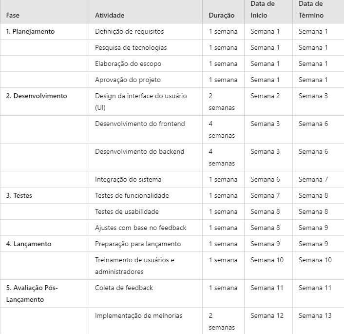
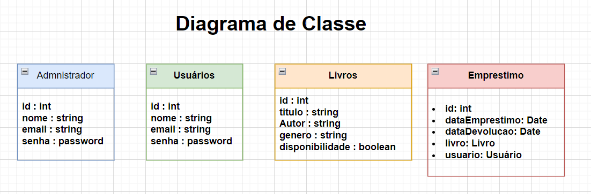
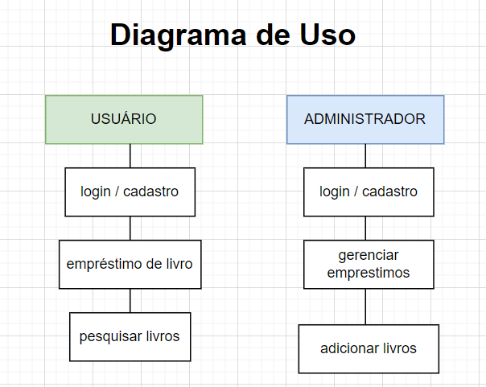
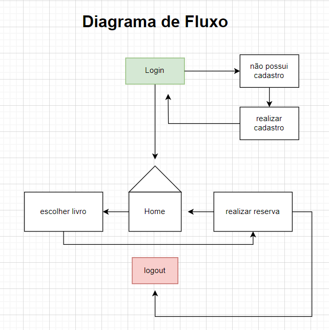

sistema de gerenciamento de biblioteca online

Escopo
Desenvolver um sistema online para gerenciamento de biblioteca que permita a catalogação, pesquisa, empréstimo e devolução de livros, além de facilitar a administração de usuários e estatísticas de uso.

-----------------------------------------------------------------------------------------------
Objetivos

Específicos : 
- Desenvolver uma interface amigável para usuários e administradores que facilite a navegação e o uso do sistema.
- Implementar um sistema de cadastro e autenticação seguro para usuários.
- Estabelecer um processo automatizado para empréstimos e devoluções de livros.
- Desenvolver um painel de administração para gerenciar livros e usuários.

Atingíveis :
- Utilizar tecnologias conhecidas e com suporte ativo para garantir que a equipe de desenvolvimento tenha os recursos necessários.
- Planejar a fase de testes com usuários reais para ajustar funcionalidades antes do lançamento final.

Relevantes : 
-Facilitar o acesso à leitura e à informação para a comunidade local, promovendo a cultura e a educação.
-Integrar funcionalidades que atendam às necessidades dos usuários e dos administradores, garantindo a sustentabilidade do sistema.
-Contribuir para a digitalização de bibliotecas, acompanhando as tendências atuais de gerenciamento de informações.

--------------------------------------------------------------------------------------------------

Recursos necessários :

Recursos Humanos 
Desenvolvedores: Profissionais com experiência em POO, familiarizados com as linguagens e frameworks escolhidos.
Designer UI/UX: Especialista em design de interfaces e experiência do usuário.
Gerente de Projeto: Responsável pelo planejamento, monitoramento e controle do projeto.
Testadores: Profissionais para realizar testes de funcionalidade, usabilidade e desempenho.

Frontend
Linguagens: HTML, CSS, JavaScript.
Frameworks: React, Angular ou Vue.js para desenvolvimento da interface do usuário.

Backend
Linguagens: Node.js (JavaScript) ou Python (Flask ou Django).
Padrões de Projeto: MVC (Model-View-Controller) para organização do código.

Banco de Dados
SGBD: MySQL ou PostgreSQL para armazenamento de dados.

--------------------------------------------------------------------------------------------------
Análise de Riscos e Mitigação

1 - Atrasos no Cronograma
mitigação : Ter um cronograma de contingência para lidar com imprevistos.

2 - Problemas de Usabilidade
mitigação : Conduzir testes de usabilidade durante o desenvolvimento para coletar feedback dos usuários.

3 - Alterações constantes nas funcionalidades e requisitos do projeto
mitigação : Definir claramente os requisitos no início do projeto e documentá-los.

4- O sistema pode apresentar falhas ou bugs que afetam seu funcionamento.
mitigação : Ter um plano de manutenção e suporte para corrigir rapidamente qualquer problema após o lançamento.

--------------------------------------------------------------------------------------------------

Cronograma :

-------------------------------------------------------------------------------------------------

Diagramas : 

